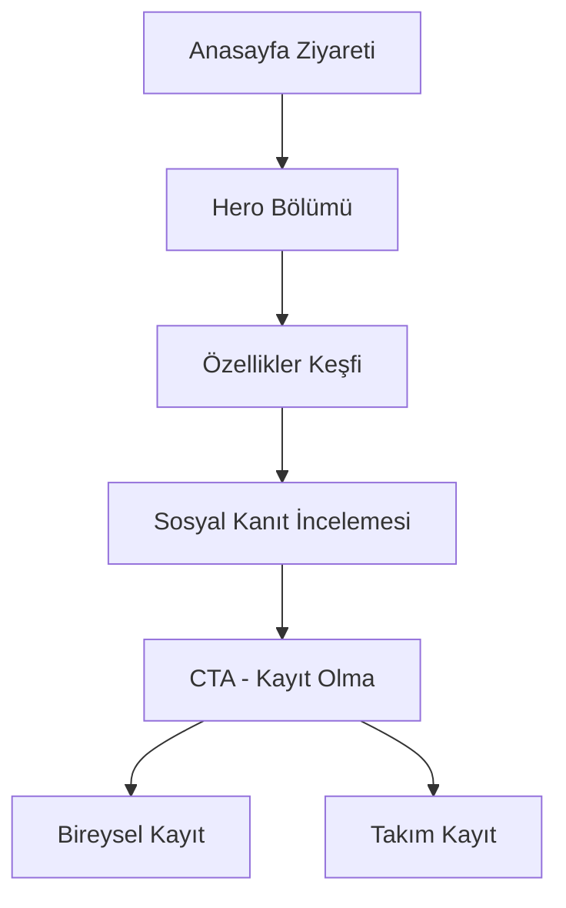

# Verimly Anasayfa Tasarım Planı

## 1. Proje Genel Bakış
Verimly, dijital kaosun odaklanmaya dönüştürüldüğü, Pomodoro tekniği ve oyunlaştırma ile verimliliği artıran modern bir zaman yönetimi platformudur. Anasayfa, kullanıcıları "kaostan kurtarma" temasıyla karşılayarak hem bireysel hem de takım kullanıcıları için çözümler sunar.

## 2. Temel Özellikler

### 2.1 Kullanıcı Rolleri
| Rol | Kayıt Yöntemi | Temel Yetkiler |
|-----|---------------|----------------|
| Bireysel Kullanıcı | E-posta ile kayıt | Kişisel Pomodoro, görev yönetimi, raporlama |
| Takım Kullanıcısı | Takım davetiyesi/kurumsal kayıt | Takım yönetimi, işbirliği araçları, gelişmiş raporlama |

### 2.2 Anasayfa Modülleri
Verimly anasayfası aşağıdaki ana bölümlerden oluşur:
1. **Hero Bölümü**: Ana başlık, alt başlık ve CTA butonları
2. **Özellikler Bölümü**: Pomodoro Tekniği, Oyunlaştırma, Görev Yönetimi, Raporlama
3. **Sosyal Kanıt**: Kullanıcı yorumları ve başarı hikayeleri
4. **Son CTA**: Kayıt olmaya teşvik eden final çağrısı

### 2.3 Sayfa Detayları
| Sayfa Adı | Modül Adı | Özellik Açıklaması |
|-----------|-----------|--------------------|
| Anasayfa | Hero Bölümü | Ana başlık "Dijital Kaosu Odaklanmaya Dönüştürün", alt başlık "Pomodoro tekniği ve oyunlaştırma ile verimliliğinizi yeniden keşfedin", bireysel ve takım CTA butonları |
| Anasayfa | Özellikler Bölümü | 4 ana özellik kartı: Pomodoro Tekniği (zamanlayıcı ve odaklanma), Oyunlaştırma (rozetler ve seviye sistemi), Görev Yönetimi (organize etme araçları), Raporlama (ilerleme takibi) |
| Anasayfa | Sosyal Kanıt | Kullanıcı testimonialları, başarı metrikleri, güven göstergeleri |
| Anasayfa | Footer CTA | Son kayıt çağrısı, sosyal medya linkleri, iletişim bilgileri |

## 3. Temel Süreç
Kullanıcı anasayfaya gelir → Hero bölümünde değer önerisi ile karşılaşır → Özellikler bölümünde çözümleri keşfeder → Sosyal kanıtları görür → CTA butonları ile kayıt olmaya yönlendirilir.

## 4. Kullanıcı Arayüzü Tasarımı

### 4.1 Tasarım Stili
- **Ana Renkler**: 
  - Birincil: #2563EB (Sakin mavi - odaklanma)
  - İkincil: #10B981 (Yeşil - başarı ve büyüme)
  - Vurgu: #F59E0B (Turuncu - enerji ve motivasyon)
- **Buton Stili**: Yuvarlatılmış köşeler (8px radius), hover efektleri ile
- **Tipografi**: 
  - Ana başlık: Inter Bold, 48px (mobile: 32px)
  - Alt başlık: Inter Regular, 20px (mobile: 16px)
  - Gövde metni: Inter Regular, 16px (mobile: 14px)
- **Layout**: Card-based tasarım, üst navigasyon, mobile-first yaklaşım
- **İkonlar**: Feather Icons seti, minimalist ve tutarlı stil

### 4.2 Sayfa Tasarım Genel Bakışı

| Sayfa Adı | Modül Adı | UI Elementleri |
|-----------|-----------|----------------|
| Anasayfa | Hero Bölümü | Gradient arkaplan (#2563EB to #1E40AF), merkezi hizalama, büyük tipografi, 2 CTA butonu (birincil mavi, ikincil beyaz outline) |
| Anasayfa | Özellikler | 4 sütunlu grid (mobile: 1 sütun), her kart için ikon + başlık + açıklama, hover animasyonları |
| Anasayfa | Sosyal Kanıt | 3 sütunlu testimonial kartları, kullanıcı avatarları, yıldız derecelendirmeleri |
| Anasayfa | Footer CTA | Koyu arkaplan (#1F2937), kontrast beyaz metin, merkezi CTA butonu |

### 4.3 Responsive Tasarım
- **Mobile-First**: 320px'den başlayarak tasarım
- **Breakpoints**: 
  - Mobile: 320px - 768px
  - Tablet: 768px - 1024px  
  - Desktop: 1024px+
- **Touch Optimizasyonu**: Minimum 44px touch target, swipe gesture desteği
- **Performance**: Lazy loading, optimized images, critical CSS inline

## 5. İçerik Stratejisi

### 5.1 Hero Bölümü İçeriği
- **Ana Başlık**: "Dijital Kaosu Odaklanmaya Dönüştürün"
- **Alt Başlık**: "Pomodoro tekniği ve oyunlaştırma ile verimliliğinizi yeniden keşfedin"
- **CTA Butonları**: 
  - "Bireysel Olarak Başla" (Birincil)
  - "Takımım İçin Dene" (İkincil)

### 5.2 Özellikler Bölümü
1. **Pomodoro Tekniği**
   - İkon: Timer/Clock
   - Başlık: "Odaklanmış Çalışma"
   - Açıklama: "25 dakikalık odaklanma seansları ile verimliliğinizi maksimize edin"

2. **Oyunlaştırma**
   - İkon: Trophy/Badge
   - Başlık: "Motivasyon Sistemi"
   - Açıklama: "Rozetler, seviyeler ve başarımlarla çalışmayı eğlenceli hale getirin"

3. **Görev Yönetimi**
   - İkon: CheckSquare
   - Başlık: "Akıllı Organizasyon"
   - Açıklama: "Görevlerinizi önceliklendirin ve ilerlemenizi takip edin"

4. **Raporlama**
   - İkon: BarChart
   - Başlık: "Detaylı Analiz"
   - Açıklama: "Çalışma alışkanlıklarınızı analiz edin ve gelişim alanlarını keşfedin"

## 6. Teknik Gereksinimler

### 6.1 Performance Hedefleri
- **Lighthouse Score**: 90+ (Performance, Accessibility, Best Practices, SEO)
- **Core Web Vitals**:
  - LCP (Largest Contentful Paint): < 2.5s
  - FID (First Input Delay): < 100ms
  - CLS (Cumulative Layout Shift): < 0.1

### 6.2 Accessibility (WCAG 2.1 AA)
- Keyboard navigasyonu desteği
- Screen reader uyumluluğu
- Renk kontrastı minimum 4.5:1
- Alt text tüm görseller için
- Focus indicators görünür

### 6.3 SEO Optimizasyonu
- Semantic HTML5 yapısı
- Meta tags ve Open Graph
- Structured data (JSON-LD)
- Sitemap ve robots.txt
- Page speed optimization

## 7. Animasyon ve Etkileşimler

### 7.1 Micro-interactions
- Buton hover efektleri (scale 1.05, shadow artışı)
- Kart hover animasyonları (yukarı hareket, shadow)
- Form input focus states
- Loading states ve progress indicators

### 7.2 Sayfa Geçişleri
- Fade-in animasyonları sayfa yüklenirken
- Scroll-triggered animations (AOS - Animate On Scroll)
- Smooth scrolling navigation
- Parallax efektleri (subtle, performance-friendly)

## 8. A/B Test Planı

### 8.1 Test Edilecek Elementler
- CTA buton metinleri ve renkleri
- Hero bölümü başlık varyasyonları
- Özellikler bölümü sıralaması
- Sosyal kanıt yerleşimi

### 8.2 Başarı Metrikleri
- Conversion rate (kayıt olma oranı)
- Bounce rate
- Time on page
- Scroll depth
- CTA click-through rates