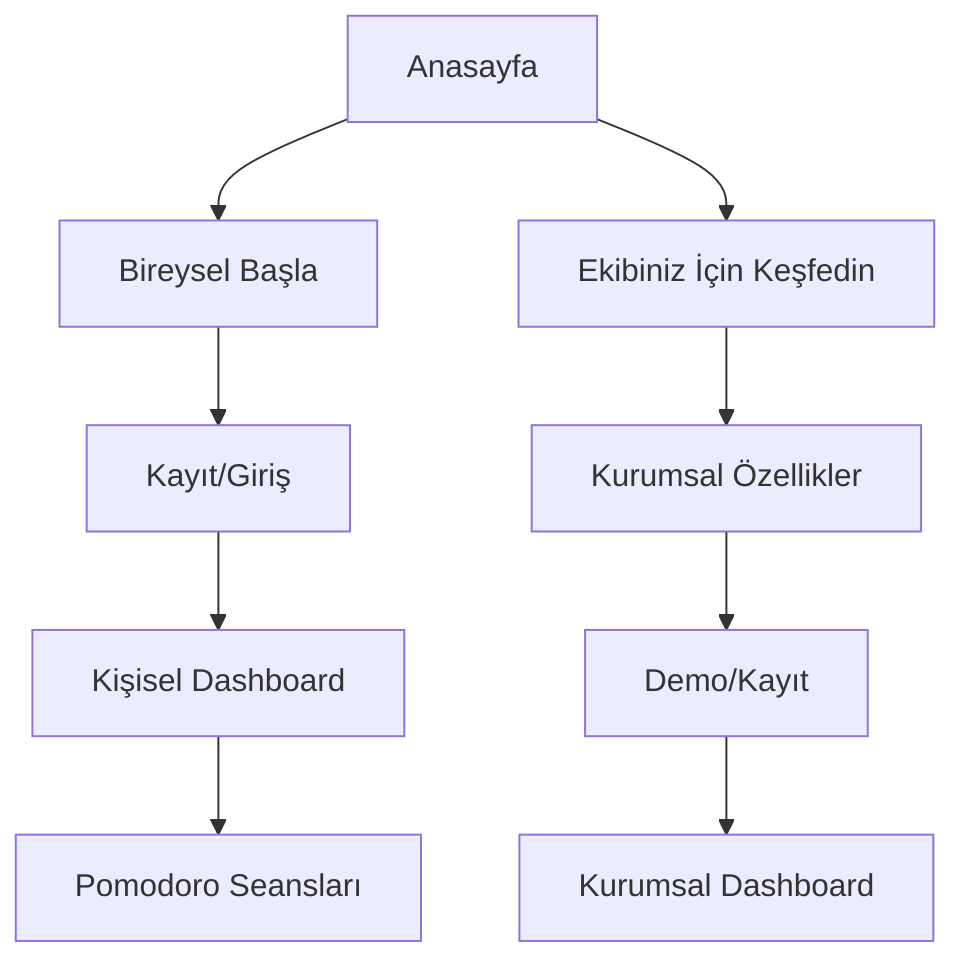

# Verimly Proje Dönüşüm Planı

## 1. Proje Genel Bakış
TimeTracker projesinin Verimly olarak yeniden yapılandırılması ve modern bir verimlilik platformuna dönüştürülmesi projesidir. Verimly, "dijital kaostan kurtulma" vaadi ile kullanıcılara odaklanma ve verimlilik artırma çözümleri sunar.

- **Hedef URL**: https://verimly.codifya.com
- **Ana Amaç**: Pomodoro tekniği ve oyunlaştırma ile bireysel ve kurumsal verimliliği artırmak
- **Pazar Değeri**: Dijital çağda artan dikkat dağınıklığı sorununa modern, bilimsel temelli çözümler sunmak

## 2. Temel Özellikler

### 2.1 Kullanıcı Rolleri

| Rol | Kayıt Yöntemi | Temel Yetkiler |
|-----|---------------|----------------|
| Personal | E-posta kaydı | Bireysel verimlilik takibi, Pomodoro seansları, kişisel raporlar |
| Company | Kurumsal davet kodu | Ekip yönetimi, çoklu kullanıcı takibi, kurumsal raporlama |
| Admin | Sistem yöneticisi erişimi | Platform yönetimi, kullanıcı yönetimi, sistem konfigürasyonu |

### 2.2 Özellik Modülleri

Verimly'nin yeni anasayfası aşağıdaki ana bölümlerden oluşur:

1. **Kahraman Bölümü (Hero Section)**: Ana başlık, alt başlık, görsel ve değer teklifi sunumu
2. **Çağrı Butonları (CTA)**: Bireysel ve kurumsal kullanıcılar için ayrı giriş noktaları
3. **Özellik Tanıtım Bölümü**: Dört ana özelliğin görsel sunumu
4. **Navigasyon**: Mobil-öncelikli hamburger menü sistemi

### 2.3 Sayfa Detayları

| Sayfa Adı | Modül Adı | Özellik Açıklaması |
|-----------|-----------|--------------------|
| Anasayfa | Kahraman Bölümü | Ana başlık "Dijital Kaosu Odaklanmaya Dönüştürün", alt başlık "Pomodoro tekniği ve oyunlaştırma ile verimliliğinizi yeniden keşfedin", sakinleştirici görsel |
| Anasayfa | CTA Butonları | "Bireysel Başla" butonu - kayıt/giriş yönlendirmesi, "Ekibiniz İçin Keşfedin" butonu - kurumsal özellikler sayfası |
| Anasayfa | Özellik Bölümü | Pomodoro Tekniği tanıtımı, Oyunlaştırma özellikleri, Görev Yönetimi, Raporlama sistemi |
| Anasayfa | Navigasyon | Mobil hamburger menü, masaüstü horizontal menü, erişilebilir klavye navigasyonu |

## 3. Temel Süreç

**Bireysel Kullanıcı Akışı:**
Kullanıcı anasayfaya gelir → "Bireysel Başla" butonuna tıklar → Kayıt/Giriş sayfasına yönlendirilir → Kişisel dashboard'a erişir → Pomodoro seansları başlatır → İlerleme takibi yapar

**Kurumsal Kullanıcı Akışı:**
Kullanıcı anasayfaya gelir → "Ekibiniz İçin Keşfedin" butonuna tıklar → Kurumsal özellikler sayfasını görür → Demo talep eder veya kayıt olur → Ekip yönetimi dashboard'ına erişir

## 4. Kullanıcı Arayüzü Tasarımı

### 4.1 Tasarım Stili

- **Ana Renkler**: Sakinleştirici yumuşak mavi (#4A90E2), yeşil tonları (#7ED321)
- **Vurgu Renkleri**: Canlı turuncu (#FF6B35), altın sarısı (#FFD700)
- **Buton Stili**: Yuvarlatılmış köşeler (border-radius: 8px), hover efektleri
- **Tipografi**: Inter veya Poppins font ailesi, başlıklar için 24-48px, metin için 16-18px
- **Layout**: Card-based tasarım, üst navigasyon, mobil-öncelikli grid sistem
- **İkonlar**: SVG formatında, minimalist ve tutarlı stil

### 4.2 Sayfa Tasarım Genel Bakışı

| Sayfa Adı | Modül Adı | UI Elemanları |
|-----------|-----------|---------------|
| Anasayfa | Kahraman Bölümü | Gradient arka plan (#4A90E2 → #7ED321), büyük başlık (48px), alt başlık (18px), merkezi hizalama, hero görseli |
| Anasayfa | CTA Butonları | Primary button (#FF6B35), Secondary button (outline), 16px padding, bold text, hover animasyonları |
| Anasayfa | Özellik Bölümü | 2x2 grid (mobil 1x4), SVG ikonlar (64px), başlık (20px), açıklama (16px), card shadow efekti |
| Anasayfa | Navigasyon | Hamburger menü (mobil), horizontal menü (desktop), sticky header, logo (32px yükseklik) |

### 4.3 Duyarlılık (Responsiveness)

**Mobil-Öncelikli Yaklaşım**: Tasarım 320px genişlikten başlayarak geliştirilir. Hamburger menü mobil cihazlarda kullanılır, içerik dikey olarak akar. Tablet (768px+) ve masaüstü (1024px+) için progressif geliştirme uygulanır. Touch etkileşimi optimize edilir, minimum 44px dokunma alanları sağlanır.

## 5. Teknik Altyapı Gereksinimleri

### 5.1 Performans Optimizasyonu
- WebP formatında optimize edilmiş görseller
- SVG ikonlar ve vektörel grafikler
- Lazy loading implementasyonu
- Minimal CSS ve JavaScript bundle'ları
- CDN entegrasyonu

### 5.2 Erişilebilirlik (Accessibility)
- WCAG 2.1 AA standartlarına uyum
- Klavye navigasyonu desteği
- "İçeriğe Atla" (Skip Link) özelliği
- Renk kontrast oranları (minimum 4.5:1)
- Screen reader uyumluluğu
- Alt text'ler ve ARIA etiketleri

### 5.3 SEO ve Meta Veriler
- Semantic HTML5 yapısı
- Open Graph meta etiketleri
- Twitter Card desteği
- Structured data markup
- Sitemap ve robots.txt

## 6. İmplementasyon Stratejisi

### 6.1 Geliştirme Aşamaları
1. **Faz 1**: Mevcut projenin yedeklenmesi ve yeni branch oluşturulması
2. **Faz 2**: Anasayfa HTML iskeletinin oluşturulması
3. **Faz 3**: Mobil-öncelikli CSS stillerinin geliştirilmesi
4. **Faz 4**: Responsive tasarım ve tablet/desktop optimizasyonu
5. **Faz 5**: JavaScript etkileşimlerinin eklenmesi
6. **Faz 6**: Performans ve erişilebilirlik testleri
7. **Faz 7**: SEO optimizasyonu ve meta veri eklenmesi

### 6.2 Kalite Kontrol
- Cross-browser testing (Chrome, Firefox, Safari, Edge)
- Mobile device testing (iOS, Android)
- Performance auditing (Lighthouse)
- Accessibility testing (axe-core)
- User acceptance testing

### 6.3 Deployment Stratejisi
- Staging environment'ta test
- A/B testing için feature flags
- Progressive rollout
- Monitoring ve analytics entegrasyonu

Bu dokümantasyon, Verimly projesinin başarılı bir şekilde dönüştürülmesi için gerekli tüm teknik ve tasarım gereksinimlerini kapsamaktadır.