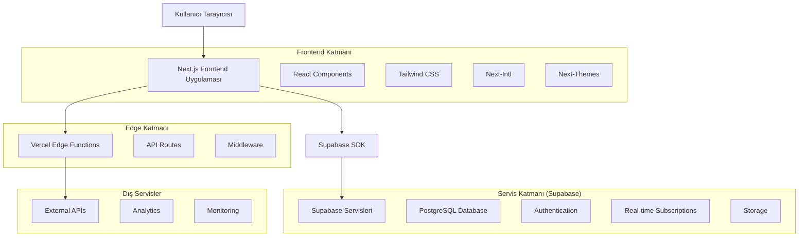
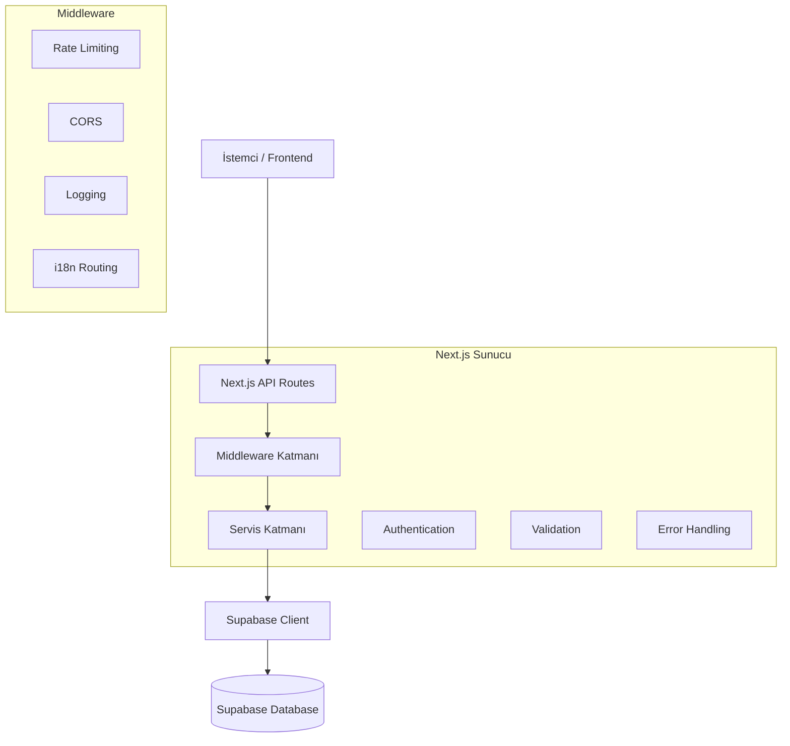
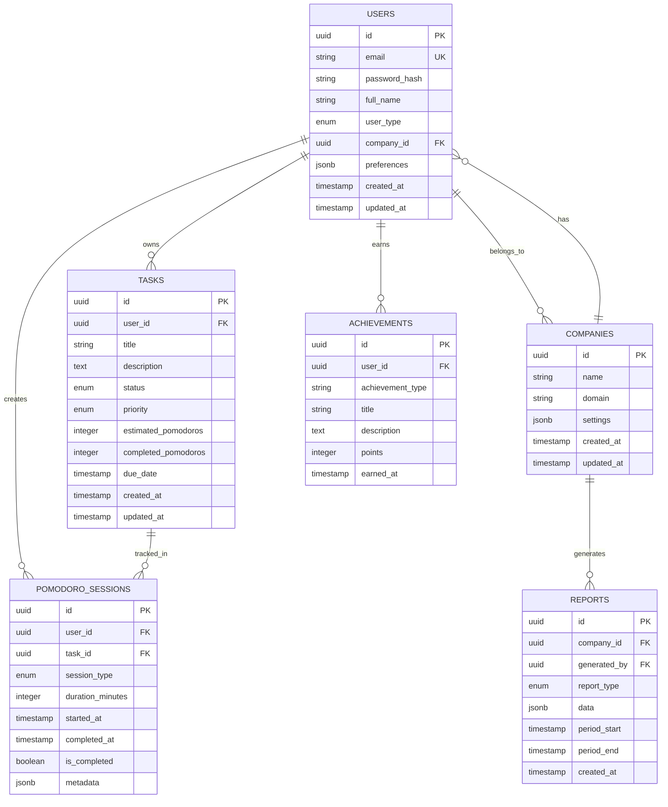

# Verimly Teknik Mimari Dokümantasyonu

## 1. Mimari Tasarım



## 2. Teknoloji Açıklaması

- **Frontend**: Next.js@14 + React@18 + TypeScript + Tailwind CSS@3 + Framer Motion
- **Backend**: Supabase (PostgreSQL + Auth + Real-time + Storage)
- **Deployment**: Vercel (Edge Functions + CDN)
- **Styling**: Tailwind CSS + CSS Modules + Styled Components (seçmeli)
- **State Management**: Zustand + React Query
- **Internationalization**: next-intl
- **Theme**: next-themes + CSS Variables
- **Icons**: Lucide React + Custom SVGs
- **Analytics**: Vercel Analytics + Google Analytics

## 3. Route Tanımları

| Route | Amaç |
|-------|-------|
| / | Anasayfa - Hero section, özellikler, CTA butonları |
| /[locale] | Çok dilli anasayfa (tr, en) |
| /[locale]/auth/login | Giriş sayfası - bireysel ve kurumsal kullanıcılar |
| /[locale]/auth/signup | Kayıt sayfası - kullanıcı tipi seçimi |
| /[locale]/auth/forgot-password | Şifre sıfırlama sayfası |
| /[locale]/dashboard | Kişisel dashboard - Pomodoro, görevler, istatistikler |
| /[locale]/dashboard/company | Kurumsal dashboard - ekip yönetimi, raporlar |
| /[locale]/dashboard/admin | Admin paneli - sistem yönetimi |
| /[locale]/features | Özellikler detay sayfası |
| /[locale]/pricing | Fiyatlandırma sayfası |
| /[locale]/about | Hakkımızda sayfası |
| /api/auth/[...nextauth] | NextAuth.js API routes |
| /api/webhooks/supabase | Supabase webhook handlers |

## 4. API Tanımları

### 4.1 Temel API

**Kullanıcı Kimlik Doğrulama**
```
POST /api/auth/signup
```

İstek:
| Parametre Adı | Parametre Tipi | Zorunlu | Açıklama |
|---------------|----------------|---------|----------|
| email | string | true | Kullanıcı e-posta adresi |
| password | string | true | Şifre (minimum 8 karakter) |
| userType | string | true | Kullanıcı tipi: 'personal', 'company', 'admin' |
| companyName | string | false | Şirket adı (company tipi için) |

Yanıt:
| Parametre Adı | Parametre Tipi | Açıklama |
|---------------|----------------|----------|
| success | boolean | İşlem durumu |
| user | object | Kullanıcı bilgileri |
| session | object | Oturum bilgileri |

**Pomodoro Seansları**
```
POST /api/pomodoro/start
```

İstek:
| Parametre Adı | Parametre Tipi | Zorunlu | Açıklama |
|---------------|----------------|---------|----------|
| taskId | string | false | İlişkili görev ID'si |
| duration | number | true | Seans süresi (dakika) |
| type | string | true | Seans tipi: 'work', 'short_break', 'long_break' |

**Görev Yönetimi**
```
GET /api/tasks
POST /api/tasks
PUT /api/tasks/:id
DELETE /api/tasks/:id
```

**Raporlama**
```
GET /api/reports/productivity
GET /api/reports/team (company kullanıcıları için)
```

## 5. Sunucu Mimarisi



## 6. Veri Modeli

### 6.1 Veri Modeli Tanımı



### 6.2 Veri Tanımlama Dili (DDL)

**Kullanıcılar Tablosu (users)**
```sql
-- Kullanıcılar tablosu oluştur
CREATE TABLE users (
    id UUID PRIMARY KEY DEFAULT gen_random_uuid(),
    email VARCHAR(255) UNIQUE NOT NULL,
    password_hash VARCHAR(255),
    full_name VARCHAR(255) NOT NULL,
    user_type VARCHAR(20) DEFAULT 'personal' CHECK (user_type IN ('personal', 'company', 'admin')),
    company_id UUID REFERENCES companies(id),
    preferences JSONB DEFAULT '{}',
    avatar_url TEXT,
    is_active BOOLEAN DEFAULT true,
    email_verified BOOLEAN DEFAULT false,
    created_at TIMESTAMP WITH TIME ZONE DEFAULT NOW(),
    updated_at TIMESTAMP WITH TIME ZONE DEFAULT NOW()
);

-- İndeksler oluştur
CREATE INDEX idx_users_email ON users(email);
CREATE INDEX idx_users_company_id ON users(company_id);
CREATE INDEX idx_users_user_type ON users(user_type);
```

**Şirketler Tablosu (companies)**
```sql
CREATE TABLE companies (
    id UUID PRIMARY KEY DEFAULT gen_random_uuid(),
    name VARCHAR(255) NOT NULL,
    domain VARCHAR(255),
    settings JSONB DEFAULT '{}',
    subscription_plan VARCHAR(50) DEFAULT 'basic',
    is_active BOOLEAN DEFAULT true,
    created_at TIMESTAMP WITH TIME ZONE DEFAULT NOW(),
    updated_at TIMESTAMP WITH TIME ZONE DEFAULT NOW()
);

CREATE INDEX idx_companies_domain ON companies(domain);
```

**Görevler Tablosu (tasks)**
```sql
CREATE TABLE tasks (
    id UUID PRIMARY KEY DEFAULT gen_random_uuid(),
    user_id UUID NOT NULL REFERENCES users(id) ON DELETE CASCADE,
    title VARCHAR(255) NOT NULL,
    description TEXT,
    status VARCHAR(20) DEFAULT 'todo' CHECK (status IN ('todo', 'in_progress', 'completed', 'cancelled')),
    priority VARCHAR(10) DEFAULT 'medium' CHECK (priority IN ('low', 'medium', 'high', 'urgent')),
    estimated_pomodoros INTEGER DEFAULT 1,
    completed_pomodoros INTEGER DEFAULT 0,
    due_date TIMESTAMP WITH TIME ZONE,
    created_at TIMESTAMP WITH TIME ZONE DEFAULT NOW(),
    updated_at TIMESTAMP WITH TIME ZONE DEFAULT NOW()
);

CREATE INDEX idx_tasks_user_id ON tasks(user_id);
CREATE INDEX idx_tasks_status ON tasks(status);
CREATE INDEX idx_tasks_due_date ON tasks(due_date);
```

**Pomodoro Seansları Tablosu (pomodoro_sessions)**
```sql
CREATE TABLE pomodoro_sessions (
    id UUID PRIMARY KEY DEFAULT gen_random_uuid(),
    user_id UUID NOT NULL REFERENCES users(id) ON DELETE CASCADE,
    task_id UUID REFERENCES tasks(id) ON DELETE SET NULL,
    session_type VARCHAR(20) DEFAULT 'work' CHECK (session_type IN ('work', 'short_break', 'long_break')),
    duration_minutes INTEGER NOT NULL DEFAULT 25,
    started_at TIMESTAMP WITH TIME ZONE DEFAULT NOW(),
    completed_at TIMESTAMP WITH TIME ZONE,
    is_completed BOOLEAN DEFAULT false,
    metadata JSONB DEFAULT '{}',
    created_at TIMESTAMP WITH TIME ZONE DEFAULT NOW()
);

CREATE INDEX idx_pomodoro_sessions_user_id ON pomodoro_sessions(user_id);
CREATE INDEX idx_pomodoro_sessions_task_id ON pomodoro_sessions(task_id);
CREATE INDEX idx_pomodoro_sessions_started_at ON pomodoro_sessions(started_at DESC);
```

**Başarımlar Tablosu (achievements)**
```sql
CREATE TABLE achievements (
    id UUID PRIMARY KEY DEFAULT gen_random_uuid(),
    user_id UUID NOT NULL REFERENCES users(id) ON DELETE CASCADE,
    achievement_type VARCHAR(50) NOT NULL,
    title VARCHAR(255) NOT NULL,
    description TEXT,
    points INTEGER DEFAULT 0,
    badge_icon VARCHAR(255),
    earned_at TIMESTAMP WITH TIME ZONE DEFAULT NOW()
);

CREATE INDEX idx_achievements_user_id ON achievements(user_id);
CREATE INDEX idx_achievements_type ON achievements(achievement_type);
```

**Supabase RLS Politikaları**
```sql
-- Kullanıcılar için RLS etkinleştir
ALTER TABLE users ENABLE ROW LEVEL SECURITY;
ALTER TABLE tasks ENABLE ROW LEVEL SECURITY;
ALTER TABLE pomodoro_sessions ENABLE ROW LEVEL SECURITY;
ALTER TABLE achievements ENABLE ROW LEVEL SECURITY;

-- Kullanıcılar sadece kendi verilerini görebilir
CREATE POLICY "Users can view own data" ON users
    FOR SELECT USING (auth.uid() = id);

CREATE POLICY "Users can update own data" ON users
    FOR UPDATE USING (auth.uid() = id);

-- Görevler için politikalar
CREATE POLICY "Users can manage own tasks" ON tasks
    FOR ALL USING (auth.uid() = user_id);

-- Pomodoro seansları için politikalar
CREATE POLICY "Users can manage own sessions" ON pomodoro_sessions
    FOR ALL USING (auth.uid() = user_id);

-- Başarımlar için politikalar
CREATE POLICY "Users can view own achievements" ON achievements
    FOR SELECT USING (auth.uid() = user_id);
```

**Başlangıç Verileri**
```sql
-- Varsayılan başarım türleri
INSERT INTO achievement_types (type, title, description, points) VALUES
('first_pomodoro', 'İlk Pomodoro', 'İlk Pomodoro seansınızı tamamladınız!', 10),
('daily_streak_7', '7 Günlük Seri', '7 gün üst üste Pomodoro yaptınız!', 50),
('task_master', 'Görev Ustası', '10 görevi tamamladınız!', 100),
('focus_champion', 'Odaklanma Şampiyonu', '100 Pomodoro seansı tamamladınız!', 500);
```

Bu teknik mimari, Verimly projesinin ölçeklenebilir, güvenli ve performanslı bir şekilde geliştirilmesini sağlayacak modern teknolojiler ve best practice'ler kullanmaktadır.